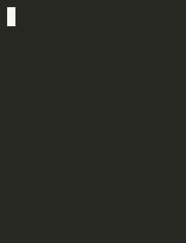

Game of life in Go - just for fun

# Running

~~~~
echo '
.........
.........
....XX...
...XXX...
...X.....
...XX....
.........
.........' | go run cmd/gooflife-cli/main.go -wrap
~~~~

## Supported Flags

 - *-wrap*: causes the grid to wrap around when counting neighbours

# Running the Web UI

~~~~
pushd ui
yarn build
popd

go run cmd/gooflife-web/main.go
open localhost:8080
~~~~

